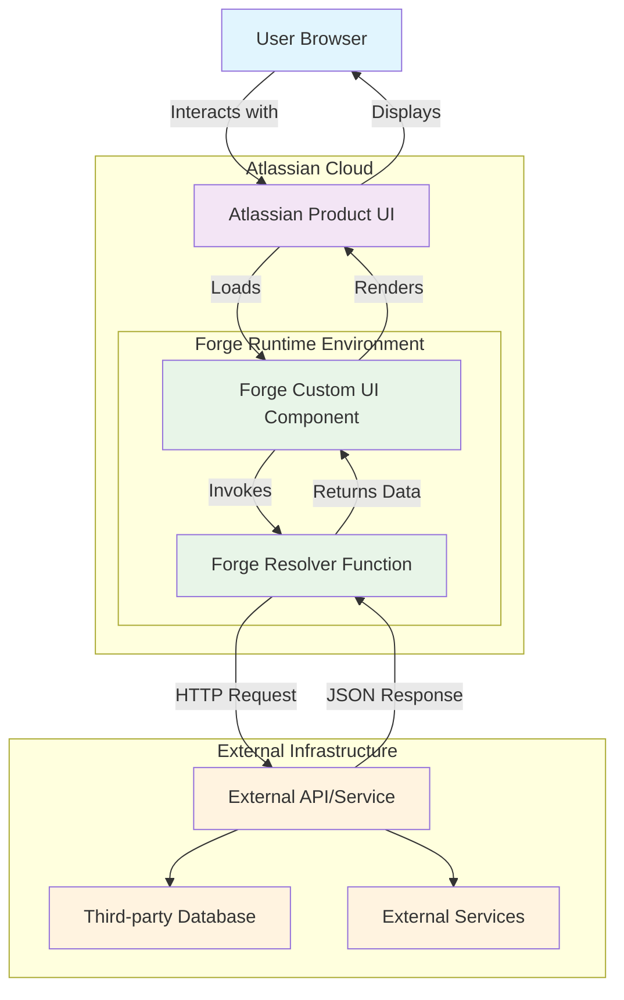
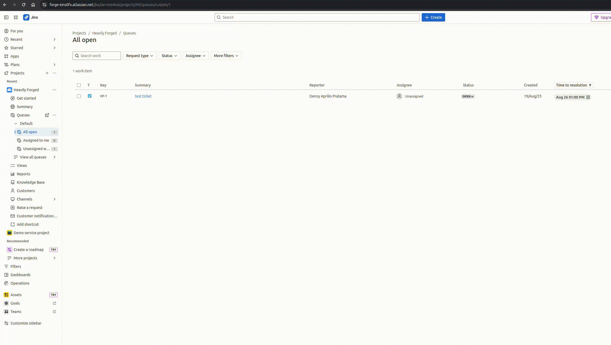
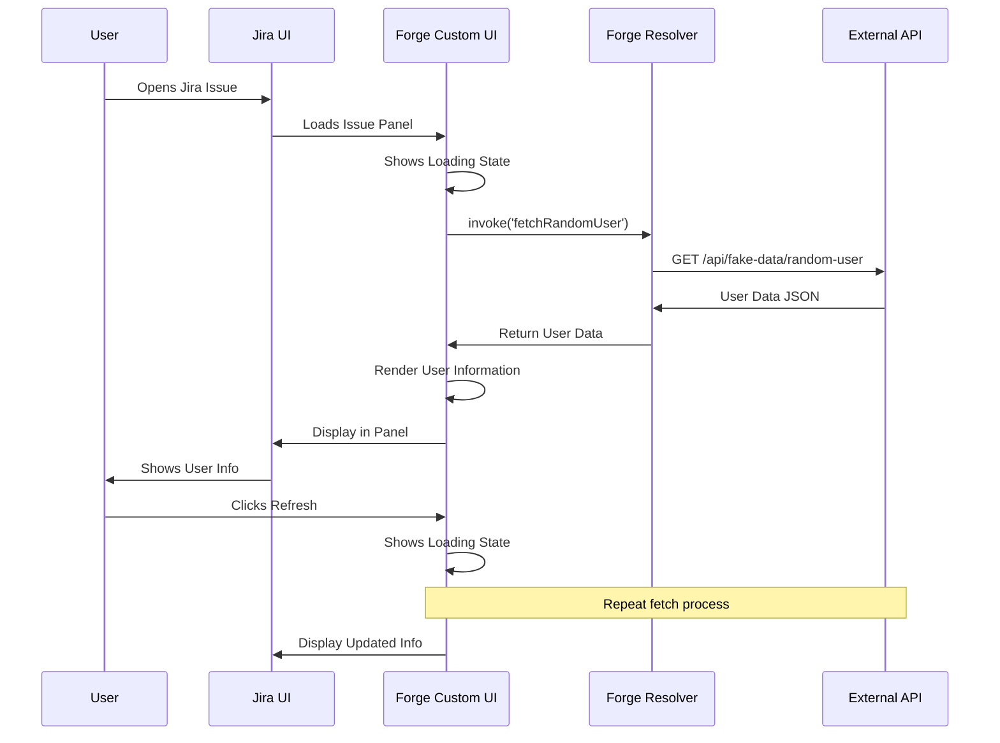

**Document Properties**
- **Title:** Using Forge Apps to Fetch External Data in Real-time Without Storing
- **Author:** Denny Aprilio Pratama
- **Email:** denny.pratama@izeno.com
- **Company:** iZeno
- **Created:** August 19, 2025
- **Version:** 1.0

> **Copyright Notice**  
> This document is the intellectual property of iZeno. Unauthorized copying, distribution, modification, or reproduction of this material, in whole or in part, is strictly prohibited without prior written consent from iZeno. All rights reserved.

---

# Using Forge Apps to Fetch External Data in Real-time Without Storing

## Table of Contents

1. [Overview](#overview)
2. [Architecture Design](#architecture-design)
3. [Core Concepts](#core-concepts)
4. [Implementation Patterns](#implementation-patterns)
5. [Sample Use Case: Real-time User Information Panel](#sample-use-case-real-time-user-information-panel)
6. [Technical Implementation](#technical-implementation)
7. [Security Considerations](#security-considerations)
8. [Performance Optimization](#performance-optimization)
9. [Best Practices](#best-practices)
10. [Troubleshooting](#troubleshooting)

## Overview

Forge apps provide a powerful platform for creating serverless applications that extend Atlassian products like Jira, Confluence, and Bitbucket. One compelling use case is fetching external data in real-time without storing it locally, which offers several advantages:

- **Data Privacy**: No sensitive data is stored within Atlassian infrastructure
- **Real-time Accuracy**: Always displays the most current information
- **Compliance**: Easier to maintain regulatory compliance when data isn't persisted
- **Cost Efficiency**: No storage costs for external data
- **Simplified Architecture**: Reduces data synchronization complexity

This approach is particularly useful for:
- Displaying live metrics from external systems
- Fetching user profiles from external identity providers
- Showing real-time status from third-party services
- Integrating with external APIs for contextual information

## Architecture Design

The following diagram illustrates the high-level architecture of a Forge app that fetches external data in real-time:



### Key Components

1. **Forge Custom UI**: React-based frontend component that provides the user interface
2. **Forge Resolver**: Backend function that handles API calls to external services
3. **External API**: Third-party service providing the data
4. **Atlassian Product**: Host application (Jira, Confluence, etc.)

## Core Concepts

### Forge Modules

Forge apps are composed of modules defined in the `manifest.yml` file. For real-time data fetching, you typically use:

- **Issue Panel Module**: Displays data within Jira issue views
- **Confluence Macro**: Embeds data in Confluence pages
- **Custom UI Resource**: Provides the frontend interface
- **Function Module**: Handles backend logic and API calls

### Resolver Pattern

The resolver pattern is central to Forge apps:
- Frontend components invoke resolver functions using `@forge/bridge`
- Resolver functions execute in the secure Forge runtime
- External API calls are made through `@forge/api`
- Data flows back to the frontend for rendering

### Security Model

Forge enforces security through:
- **Scoped Permissions**: Explicit declaration of required permissions
- **External Fetch Permissions**: Whitelist of allowed external domains
- **Runtime Isolation**: Functions execute in isolated environments
- **Content Security Policy**: Prevents unauthorized resource access

## Implementation Patterns

### 1. Direct Fetch Pattern

The simplest approach where the resolver directly calls the external API:

```javascript
resolver.define('fetchExternalData', async (req) => {
  const response = await api.fetch('https://external-api.com/data');
  return await response.json();
});
```

### 2. Error Handling Pattern

Robust error handling for external API failures:

```javascript
resolver.define('fetchWithErrorHandling', async (req) => {
  try {
    const response = await api.fetch('https://external-api.com/data');
    if (!response.ok) {
      throw new Error(`HTTP ${response.status}: ${response.statusText}`);
    }
    return { success: true, data: await response.json() };
  } catch (error) {
    return { success: false, error: error.message };
  }
});
```

### 3. Parameterized Requests Pattern

Dynamic API calls based on context or user input:

```javascript
resolver.define('fetchUserSpecificData', async (req) => {
  const { userId } = req.payload;
  const response = await api.fetch(`https://api.example.com/users/${userId}`);
  return await response.json();
});
```

## Sample Use Case: Real-time User Information Panel

This repository demonstrates a practical implementation of fetching external user data in real-time for display in a Jira issue panel.

### Use Case Overview

The application fetches random user information from an external API and displays it in a Jira issue panel. This simulates scenarios where you might need to show:
- Customer information from a CRM system
- User profiles from an identity provider
- Real-time status from external services

### Video Demonstration



The demo shows:
1. Loading state while fetching external data
2. Real-time display of user information
3. Refresh functionality for updated data
4. Error handling for failed requests

### Architecture Components



## Technical Implementation

### Manifest Configuration

The `manifest.yml` defines the app structure and permissions:

```yaml
modules:
  jira:issuePanel:
    - key: user-info-panel
      resource: main
      resolver:
        function: resolver
      viewportSize: large
      title: Fetch User Information

  function:
    - key: resolver
      handler: index.handler

resources:
  - key: main
    path: static/hello-world/build

remotes:
  - key: fake-data-api
    baseUrl: https://fake-data.ngrok.app

permissions:
  scopes:
    - read:jira-work
  external:
    fetch:
      backend:
        - https://fake-data.ngrok.app
    images:
      - https://randomuser.me

app:
  runtime:
    name: nodejs22.x
    memoryMB: 256
    architecture: arm64
```

### Backend Resolver Implementation

The resolver function handles external API communication:

```javascript
import Resolver from '@forge/resolver';
import api from '@forge/api';

const resolver = new Resolver();

resolver.define('fetchRandomUser', async (req) => {
  try {
    console.log('Fetching random user data...');
    
    const response = await api.fetch('https://fake-data.ngrok.app/api/fake-data/random-user', {
      method: 'GET',
      headers: {
        'Accept': 'application/json',
        'Content-Type': 'application/json'
      }
    });

    if (!response.ok) {
      throw new Error(`HTTP error! status: ${response.status}`);
    }

    const userData = await response.json();
    console.log('Successfully fetched user data:', userData);
    
    return {
      success: true,
      data: userData
    };
  } catch (error) {
    console.error('Error fetching random user:', error);
    return {
      success: false,
      error: error.message || 'Failed to fetch user data'
    };
  }
});

export const handler = resolver.getDefinitions();
```

### Frontend React Component

The Custom UI component manages state and user interactions:

```javascript
import React, { useState, useEffect } from 'react';
import { invoke } from '@forge/bridge';

function App() {
  const [userData, setUserData] = useState(null);
  const [loading, setLoading] = useState(true);
  const [error, setError] = useState(null);

  const fetchUserData = async () => {
    setLoading(true);
    setError(null);
    setUserData(null);

    try {
      const result = await invoke('fetchRandomUser');
      
      if (result.success) {
        setUserData(result.data);
      } else {
        setError(result.error || 'Failed to fetch user data');
      }
    } catch (err) {
      setError('An unexpected error occurred');
      console.error('Error:', err);
    } finally {
      setLoading(false);
    }
  };

  useEffect(() => {
    fetchUserData();
  }, []);

  // Render logic for loading, error, and success states
  // ... (component rendering code)
}
```

### Key Implementation Features

1. **Automatic Loading**: Data fetches automatically when the component mounts
2. **Loading States**: Visual feedback during API calls
3. **Error Handling**: Graceful degradation when external APIs fail
4. **Refresh Capability**: Users can manually refresh data
5. **Responsive Design**: Clean, professional UI that matches Atlassian design patterns

## Security Considerations

### Permission Management

Forge apps require explicit permissions for external API access:

```yaml
permissions:
  external:
    fetch:
      backend:
        - https://trusted-api.com
        - https://another-service.com
    images:
      - https://image-cdn.com
```

### Data Handling Best Practices

1. **No Persistent Storage**: Data is fetched and displayed without local storage
2. **Input Validation**: Validate all data received from external APIs
3. **Error Sanitization**: Don't expose sensitive error details to users
4. **Rate Limiting**: Implement client-side throttling for API calls

### Network Security

- Use HTTPS for all external API calls
- Implement proper authentication headers
- Validate SSL certificates
- Handle network timeouts gracefully

## Performance Optimization

### Caching Strategies

While this pattern avoids persistent storage, you can implement temporary caching:

```javascript
let cache = new Map();
const CACHE_DURATION = 5 * 60 * 1000; // 5 minutes

resolver.define('fetchWithCache', async (req) => {
  const cacheKey = req.payload.key;
  const cached = cache.get(cacheKey);
  
  if (cached && Date.now() - cached.timestamp < CACHE_DURATION) {
    return cached.data;
  }
  
  const data = await fetchFromExternalAPI();
  cache.set(cacheKey, { data, timestamp: Date.now() });
  
  return data;
});
```

### Loading Optimization

1. **Progressive Loading**: Show partial data as it becomes available
2. **Skeleton Screens**: Provide visual placeholders during loading
3. **Debounced Requests**: Prevent excessive API calls
4. **Background Refresh**: Update data without blocking the UI

### Resource Management

- Set appropriate memory limits in the manifest
- Use efficient data structures
- Clean up resources after API calls
- Monitor function execution times

## Best Practices

### API Integration

1. **Idempotent Operations**: Ensure API calls can be safely retried
2. **Timeout Handling**: Set reasonable timeouts for external calls
3. **Fallback Mechanisms**: Provide default values when APIs are unavailable
4. **Version Management**: Handle API versioning changes gracefully

### User Experience

1. **Loading Indicators**: Always show progress during data fetching
2. **Error Recovery**: Provide clear error messages and retry options
3. **Data Freshness**: Indicate when data was last updated
4. **Accessibility**: Ensure UI components are accessible to all users

### Code Organization

1. **Separation of Concerns**: Keep API logic separate from UI logic
2. **Reusable Components**: Create modular, reusable functions
3. **Configuration Management**: Use environment variables for API endpoints
4. **Testing Strategy**: Mock external APIs for unit testing

## Troubleshooting

### Common Issues

#### External API Not Accessible

**Symptoms**: HTTP errors, timeout exceptions
**Solutions**:
- Verify the external domain is listed in permissions
- Check network connectivity from Forge runtime
- Validate API endpoint URLs and authentication

#### CORS Errors

**Symptoms**: Cross-origin request blocked
**Solutions**:
- External API calls from Forge resolvers don't face CORS issues
- CORS only affects direct browser-to-API calls
- Use resolver functions for all external API access

#### Memory Limits

**Symptoms**: Function timeouts, memory errors
**Solutions**:
- Increase memory allocation in manifest
- Optimize data processing logic
- Implement streaming for large datasets

#### Rate Limiting

**Symptoms**: HTTP 429 errors, API quota exceeded
**Solutions**:
- Implement exponential backoff
- Add client-side rate limiting
- Cache frequently accessed data temporarily

### Debugging Techniques

1. **Console Logging**: Use `console.log()` in resolver functions
2. **Forge Logs**: Monitor logs using `forge logs`
3. **Network Monitoring**: Check API response times and errors
4. **Error Boundaries**: Implement React error boundaries for UI errors

### Performance Monitoring

```javascript
resolver.define('monitoredFetch', async (req) => {
  const startTime = Date.now();
  
  try {
    const result = await api.fetch(url);
    const duration = Date.now() - startTime;
    console.log(`API call completed in ${duration}ms`);
    return result;
  } catch (error) {
    const duration = Date.now() - startTime;
    console.error(`API call failed after ${duration}ms:`, error);
    throw error;
  }
});
```

## Conclusion

Forge apps provide an excellent platform for fetching external data in real-time without storage. This approach offers significant advantages in terms of data privacy, compliance, and architectural simplicity. By following the patterns and best practices outlined in this document, you can build robust, secure, and performant applications that seamlessly integrate external data into Atlassian products.

The sample implementation demonstrates practical techniques for handling loading states, error conditions, and user interactions while maintaining a clean, professional user experience. This foundation can be extended to support more complex scenarios and integrate with various external services and APIs.

---

For more information about Forge development, visit the [official Forge documentation](https://developer.atlassian.com/platform/forge/).
