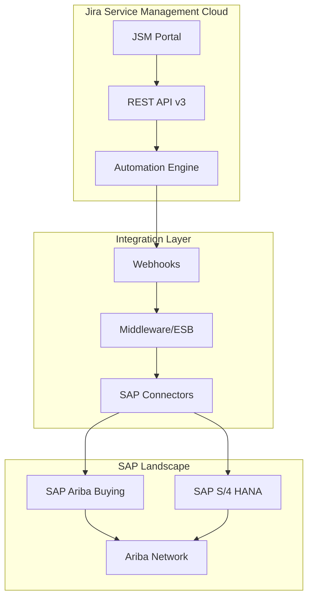
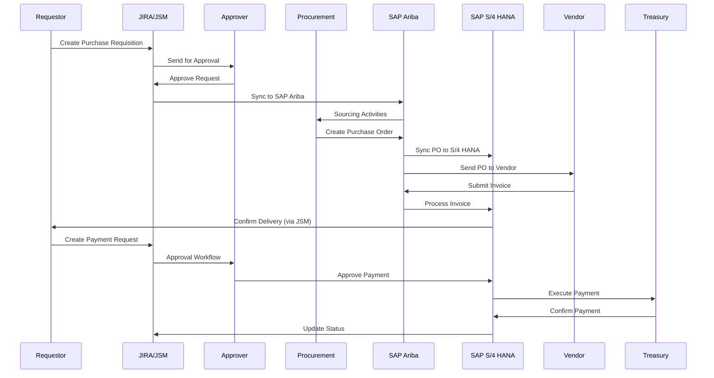
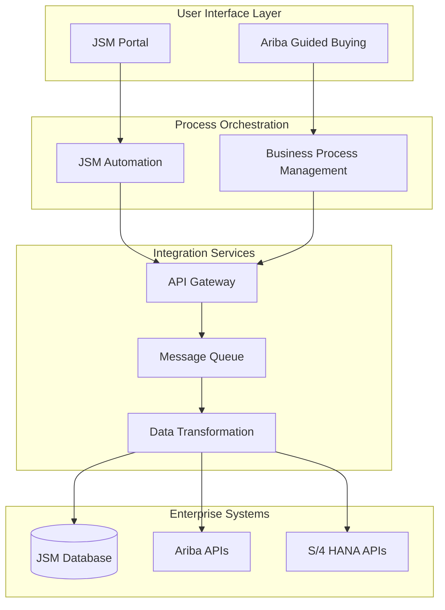

# JSM SAP Integration Analysis Report

## Executive Summary

This analysis provides comprehensive research on the required SAP modules and Jira Service Management (JSM) integration capabilities for implementing a Procure-to-Pay (P2P) process at Ayala Land Inc. Based on the business process diagram and requirements, this integration will streamline procurement workflows spanning from requisition creation in Jira to payment processing in SAP S/4 HANA.

### Key Findings:
- **SAP Ariba Buying & Invoicing** and **SAP S/4 HANA Procurement modules** are required
- **JSM Cloud REST API v3** provides robust integration capabilities
- **Built-in JSM Automation with Webhooks** offers seamless real-time integration
- Estimated licensing costs range from $100K-500K annually depending on user count and modules

## Scope & Objectives

### Business Process Overview
The integration covers a complete P2P cycle involving:
1. **Request Management**: JIRA-based requisition creation and approval
2. **Procurement Processing**: SAP Ariba sourcing and purchasing
3. **Financial Processing**: SAP S/4 HANA payment and treasury operations

### Integration Points
- Bi-directional data synchronization between JSM and SAP systems
- Real-time status updates across platforms
- Automated workflow triggers based on approval states

## Research Findings

### Required SAP Modules & Licensing

#### 1. SAP Ariba Suite (Cloud-based)

**Primary Modules Required:**
- **SAP Ariba Buying & Invoicing**: Core P2P functionality
  - Requisition management
  - Purchase order creation
  - Invoice processing
  - Vendor collaboration

- **SAP Ariba Guided Buying**: Enhanced user experience
  - Intuitive procurement interface
  - Policy compliance enforcement
  - Catalog-based purchasing

**Licensing Model (2025):**
- **Subscription-based pricing**: $100-300/user/month
- **RISE with SAP option**: All-in-one subscription including infrastructure
- **Integration licensing**: SAP Ariba Network connectivity included

**Key Features:**
- Native S/4 HANA integration
- Real-time data synchronization
- Advanced analytics and reporting
- AI-powered spend insights

#### 2. SAP S/4 HANA (On-premise/Cloud)

**Required Procurement Modules:**
- **Materials Management (MM)**
  - Purchase requisition processing
  - Purchase order management
  - Goods receipt processing

- **Financial Accounting (FI)**
  - Invoice verification
  - Payment processing
  - Vendor management

- **Treasury and Risk Management**
  - Payment execution
  - Cash management
  - Financial reporting

**Licensing Options (2025):**

| Model | Cost Structure | Best For |
|-------|---------------|----------|
| Perpetual On-Premise | $5M+ upfront + 22% annual support | Long-term usage (10+ years) |
| Cloud Subscription | $100K+/year (OpEx) | Flexibility and lower upfront costs |
| RISE with SAP | Bundled subscription | Complete transformation |

**Additional Licensing Considerations:**
- **HANA Database**: Runtime license (15% of app value) vs Full-use license
- **Digital Access**: Required for external system integration
- **Enterprise Support**: 22% of license value annually

### Jira Service Management Integration Capabilities

#### JSM Cloud REST API v3 (2025)

**Core API Endpoints:**
```
Base URL: https://your-domain.atlassian.net/rest/servicedeskapi/

Key Resources:
- /servicedesk - Service desk management
- /request - Customer request handling  
- /organization - Customer organization management
- /requesttype - Request type operations
- /info - System information
```

**Authentication & Security:**
- OAuth 2.0 (3LO) authentication
- Granular permissions with scopes:
  - `read:servicedesk.customer:jira-service-management`
  - `write:servicedesk.customer:jira-service-management`

**Key Capabilities:**
- **Request Lifecycle Management**: Create, update, and track procurement requests
- **Custom Fields Support**: Extended data capture for SAP integration
- **File Attachments**: Document management integration
- **SLA Tracking**: Service level monitoring and reporting

#### Built-in JSM Automation (2025)

**Webhook Integration Features:**
- **Native Configuration**: Built into automation settings
- **Asynchronous Processing**: Dedicated thread pool for performance
- **Custom Payloads**: JSON formatting with smart values
- **HTTP Configuration**: 
  - 5-second TCP timeout
  - 20-second response timeout
  - Success criteria: HTTP 200-300 status codes

**Automation Rule Structure:**
```
WHEN: Issue Created/Updated/Transitioned
IF: Custom conditions (status, field values, etc.)
THEN: Send Webhook to SAP endpoint
```

**Advanced Features:**
- **Smart Values**: Dynamic field mapping
- **Conditional Logic**: Complex business rule implementation
- **Error Handling**: Retry mechanisms and failure notifications
- **Audit Trail**: Complete integration logging

## Analysis & Evaluation

### Integration Architecture Options



### Technical Integration Approaches

#### Option 1: Direct REST API Integration (Recommended)
**Pros:**
- Real-time data synchronization
- Lower complexity and maintenance
- Built-in error handling and retry logic
- Native JSM automation capabilities

**Cons:**
- Requires custom development
- Point-to-point integration challenges for multiple SAP systems

#### Option 2: SAP Integration Suite Gateway
**Pros:**
- Pre-packaged Ariba connectors
- Enterprise-grade message routing
- Centralized integration monitoring
- Standards-based protocols

**Cons:**
- Additional licensing costs
- Higher implementation complexity
- Vendor lock-in considerations

#### Option 3: Third-party Integration Platform (MuleSoft, etc.)
**Pros:**
- 200+ pre-built connectors
- Visual integration design
- Advanced transformation capabilities
- Comprehensive monitoring

**Cons:**
- Significant additional licensing costs
- Platform dependency
- Longer implementation timeline

### Data Flow Mapping

| JSM Event | SAP Ariba Action | S/4 HANA Action |
|-----------|------------------|-----------------|
| Request Created | Create PR | Update MM tables |
| Request Approved | Release PR | Trigger sourcing |
| PO Created | Update status | Create accounting docs |
| Goods Received | Update delivery | Post GR document |
| Invoice Received | Process invoice | Update FI documents |
| Payment Approved | Release payment | Execute payment run |

### Risk Assessment

#### High-Risk Areas
- **Data Consistency**: Real-time synchronization challenges
- **Security**: API authentication and data protection
- **Performance**: High-volume transaction processing
- **Compliance**: SOX and procurement policy adherence

#### Mitigation Strategies
- Implement robust error handling and retry mechanisms
- Use encrypted connections and token-based authentication
- Design for horizontal scaling and load balancing
- Build comprehensive audit trails and approval workflows

## Process/System Overview

### Current State Process Flow



### Target State Integration Architecture



## Recommendations

### Priority 1: Foundation Setup (Month 1-2)
1. **Procure SAP Ariba Buying & Invoicing licenses**
   - Start with 50 users for pilot
   - Include Guided Buying for user adoption
   - Negotiate RISE with SAP for comprehensive coverage

2. **Configure JSM Cloud Environment**
   - Set up dedicated service project for procurement
   - Design request types for different procurement categories
   - Implement approval workflows with proper stakeholder routing

3. **API Integration Framework**
   - Establish OAuth 2.0 authentication
   - Create webhook endpoints for real-time synchronization
   - Implement error handling and retry mechanisms

### Priority 2: Core Integration (Month 3-4)
1. **Bi-directional Data Sync**
   - JSM → SAP Ariba: Request creation and updates
   - SAP Ariba → JSM: Status updates and notifications
   - S/4 HANA → JSM: Financial posting confirmations

2. **Business Process Automation**
   - Automated status transitions based on SAP events
   - SLA monitoring and escalation rules
   - Document attachment synchronization

### Priority 3: Advanced Features (Month 5-6)
1. **Analytics & Reporting**
   - Cross-platform procurement dashboards
   - Spend analysis integration
   - Performance KPI tracking

2. **User Experience Enhancement**
   - Single sign-on (SSO) across platforms
   - Mobile-responsive interfaces
   - Self-service capabilities

## Implementation Considerations

### Technical Requirements
- **Network Connectivity**: Secure HTTPS connections between cloud platforms
- **Data Formats**: JSON for REST APIs, XML for SAP traditional interfaces
- **Security**: OAuth 2.0, SAML, encrypted data transmission
- **Performance**: Sub-second response times for critical transactions

### Change Management
- **User Training**: Platform-specific training for JSM, Ariba, and S/4 HANA
- **Process Documentation**: Updated SOPs reflecting integrated workflows
- **Support Structure**: Dedicated integration support team

### Compliance & Governance
- **Data Privacy**: GDPR/CCPA compliance for personal data handling
- **Financial Controls**: SOX compliance for financial transactions
- **Audit Trail**: Complete transaction logging across systems

## Next Steps

### Immediate Actions (Week 1-2)
1. **Stakeholder Alignment Meeting**
   - Present findings to project sponsors
   - Validate business requirements and scope
   - Secure budget approval for SAP licensing

2. **Technical Architecture Review**
   - Detailed integration design sessions
   - Security and compliance review
   - Performance testing strategy

3. **Vendor Engagement**
   - SAP licensing negotiation
   - Atlassian JSM optimization consultation
   - Integration partner selection (if needed)

### Implementation Roadmap (6-Month Timeline)

| Phase | Duration | Key Deliverables |
|-------|----------|------------------|
| **Foundation** | Month 1-2 | SAP licenses, JSM setup, API framework |
| **Core Integration** | Month 3-4 | Data sync, process automation |
| **Advanced Features** | Month 5-6 | Analytics, UX enhancements |

### Success Metrics
- **Process Efficiency**: 50% reduction in P2P cycle time
- **User Adoption**: 90% user engagement within 3 months
- **Data Accuracy**: 99% synchronization accuracy
- **Cost Savings**: 20% reduction in procurement operational costs

## References & Sources

### SAP Documentation
- [SAP Ariba Procurement Solutions](https://help.sap.com/docs/ARIBA_PROCUREMENT)
- [SAP S/4HANA Licensing Guide 2025](https://redresscompliance.com/sap-licensing-for-s-4hana-the-complete-guide/)
- [SAP Ariba APIs Portal](https://api.sap.com/package/SAPAribaOpenAPIs/rest)

### Atlassian Documentation  
- [JSM Cloud REST API v3](https://developer.atlassian.com/cloud/jira/service-desk/rest/api-group-servicedesk/)
- [JSM Automation Webhooks](https://support.atlassian.com/jira-service-management-cloud/docs/integrate-with-webhook/)
- [JSM Cloud Changelog 2025](https://developer.atlassian.com/cloud/jira/service-desk/changelog/)

### Industry Research
- [Gartner Magic Quadrant for Source-to-Pay Suites 2025](https://www.gartner.com/en/documents/4018300)
- [Hackett Group 2025 Procurement Agenda](https://www.thehackettgroup.com/)

### Integration Platforms
- [MuleSoft SAP Ariba Integration](https://www.mulesoft.com/resources/api/integrate-sap-ariba-automate-supply-chain)
- [SAP Integration Suite](https://learning.sap.com/learning-journeys/exploring-the-features-of-sap-integration-suite-managed-gateway-for-spend-management-and-sap-business-network/)

---

*Analysis completed on August 15, 2025*  
*Document prepared by: Business Requirements Analyst*  
*Version: 1.0*