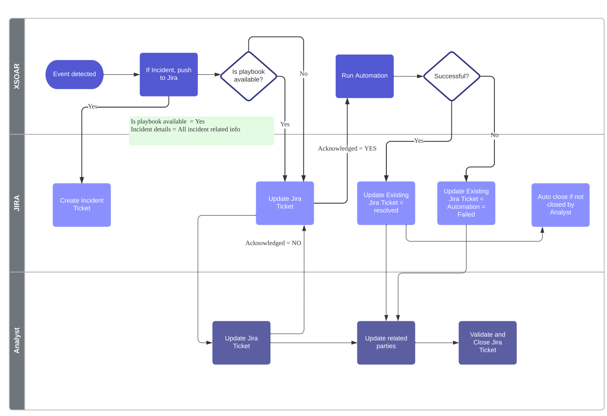

# JIRA API Mapping for Incident Response Workflow

## 📊 Example Workflow Overview



*This flowchart illustrates sample incident response workflow across XSOAR, JIRA, and Analyst layers, showing the integration points and decision flows for automated and manual incident handling.*

## 📋 API Operations Mapping

### 1. **Create Incident Ticket**
**Purpose**: Initial incident ticket creation from XSOAR

**API v2**:
```bash
POST /rest/api/2/issue
```

**API v3**:
```bash
POST /rest/api/3/issue
```

**Example Request Body**:
```json
{
  "fields": {
    "project": {
      "key": "INC"
    },
    "summary": "Security Incident - [XSOAR_ID]",
    "description": "Incident details from XSOAR...",
    "issuetype": {
      "name": "Incident"
    },
    "priority": {
      "name": "High"
    },
    "assignee": {
      "accountId": "user-account-id"
    },
    "labels": ["security", "xsoar", "automated"]
  }
}
```

---

### 2. **Update Jira Ticket** (General Updates)
**Purpose**: Add comments, update fields, add information

**API v2**:
```bash
PUT /rest/api/2/issue/{issueIdOrKey}
```

**API v3**:
```bash
PUT /rest/api/3/issue/{issueIdOrKey}
```

**Example Request Body**:
```json
{
  "fields": {
    "description": "Updated incident details...",
    "customfield_10001": "Additional investigation data"
  },
  "update": {
    "comment": [
      {
        "add": {
          "body": "Investigation update from automation"
        }
      }
    ]
  }
}
```

---

### 3. **Update Existing Jira Ticket = resolved**
**Purpose**: Transition issue to resolved status

**API v2**:
```bash
POST /rest/api/2/issue/{issueIdOrKey}/transitions
```

**API v3**:
```bash
POST /rest/api/3/issue/{issueIdOrKey}/transitions
```

**Step 1 - Get Available Transitions**:
```bash
GET /rest/api/2/issue/{issueIdOrKey}/transitions
GET /rest/api/3/issue/{issueIdOrKey}/transitions
```

**Step 2 - Execute Transition**:
```json
{
  "update": {
    "comment": [
      {
        "add": {
          "body": "Issue resolved by automation"
        }
      }
    ]
  },
  "fields": {
    "resolution": {
      "name": "Fixed"
    }
  },
  "transition": {
    "id": "31"
  }
}
```

---

### 4. **Update Existing Jira Ticket = Automation = Failed**
**Purpose**: Mark automation failure and update status

**Same endpoints as above, but with different payload**:
```json
{
  "update": {
    "comment": [
      {
        "add": {
          "body": "❌ Automation failed - manual intervention required"
        }
      }
    ]
  },
  "fields": {
    "priority": {
      "name": "Highest"
    },
    "labels": ["automation-failed", "manual-required"]
  },
  "transition": {
    "id": "21"
  }
}
```

---

### 5. **Auto Close if not Closed by Analyst**
**Purpose**: Automatically close issues after timeout

**API v2**:
```bash
POST /rest/api/2/issue/{issueIdOrKey}/transitions
```

**API v3**:
```bash
POST /rest/api/3/issue/{issueIdOrKey}/transitions
```

**Request Body**:
```json
{
  "update": {
    "comment": [
      {
        "add": {
          "body": "Auto-closed due to inactivity after resolution"
        }
      }
    ]
  },
  "transition": {
    "id": "41"
  }
}
```

---

### 6. **Update Related Parties**
**Purpose**: Add watchers, change assignee, notify stakeholders

#### **A. Add/Remove Watchers**

**API v2**:
```bash
POST /rest/api/2/issue/{issueIdOrKey}/watchers
DELETE /rest/api/2/issue/{issueIdOrKey}/watchers
```

**API v3**:
```bash
POST /rest/api/3/issue/{issueIdOrKey}/watchers
DELETE /rest/api/3/issue/{issueIdOrKey}/watchers
```

**Add Watcher Request**:
```json
{
  "accountId": "user-account-id"
}
```

#### **B. Update Assignee**

**API v2**:
```bash
PUT /rest/api/2/issue/{issueIdOrKey}/assignee
```

**API v3**:
```bash
PUT /rest/api/3/issue/{issueIdOrKey}/assignee
```

**Request Body**:
```json
{
  "accountId": "new-assignee-account-id"
}
```

#### **C. Send Notifications**

**API v2**:
```bash
POST /rest/api/2/issue/{issueIdOrKey}/notify
```

**API v3**:
```bash
POST /rest/api/3/issue/{issueIdOrKey}/notify
```

**Request Body**:
```json
{
  "subject": "Incident Update - {issue.key}",
  "textBody": "Incident status has been updated...",
  "htmlBody": "<p>Incident status has been updated...</p>",
  "to": {
    "assignee": true,
    "watchers": true,
    "voters": false,
    "users": [
      {
        "accountId": "stakeholder-account-id"
      }
    ]
  }
}
```

---

### 7. **Validate and Close Jira Ticket**
**Purpose**: Final validation and closure

**Same transition endpoints as above with validation**:

**Step 1 - Validation (Custom Field Update)**:
```bash
PUT /rest/api/2/issue/{issueIdOrKey}
PUT /rest/api/3/issue/{issueIdOrKey}
```

```json
{
  "fields": {
    "customfield_10005": "Validated by analyst",
    "customfield_10006": "2024-01-15T10:30:00.000Z"
  }
}
```

**Step 2 - Close Transition**:
```json
{
  "update": {
    "comment": [
      {
        "add": {
          "body": "✅ Incident validated and closed"
        }
      }
    ]
  },
  "transition": {
    "id": "51"
  }
}
```

---

## 🔄 Key Differences: API v2 vs v3

### **Primary Differences**

| Aspect | API v2 | API v3 |
|--------|--------|--------|
| **Content Format** | Plain text, Wiki markup | **Atlassian Document Format (ADF)** |
| **Description Field** | Simple string/wiki | Rich JSON structure |
| **Comment Body** | String | ADF JSON object |
| **User Identification** | accountId (GDPR compliant) | accountId (same) |
| **Endpoint Structure** | `/rest/api/2/` | `/rest/api/3/` |

### **Content Format Examples**

**API v2 Description**:
```json
{
  "fields": {
    "description": "This is a simple text description with *bold* text"
  }
}
```

**API v3 Description (ADF)**:
```json
{
  "fields": {
    "description": {
      "content": [
        {
          "content": [
            {
              "text": "This is a description with ",
              "type": "text"
            },
            {
              "marks": [
                {
                  "type": "strong"
                }
              ],
              "text": "bold",
              "type": "text"
            },
            {
              "text": " text",
              "type": "text"
            }
          ],
          "type": "paragraph"
        }
      ],
      "type": "doc",
      "version": 1
    }
  }
}
```

### **When to Use Which Version**

**Use API v2 when**:
- Simple text content is sufficient
- Legacy integrations
- Faster development for basic operations
- Working with older JIRA versions

**Use API v3 when**:
- Rich text formatting is required
- Modern integrations
- Need advanced content features (tables, mentions, etc.)
- Future-proofing your integration

### **Compatibility Notes**

1. **Both versions support the same core operations**
2. **Authentication is identical** (Basic Auth, API tokens, OAuth)
3. **Field names and IDs are the same**
4. **Transition IDs and workflows are identical**
5. **v3 is the recommended version** for new development

---

## 🛠 Implementation Recommendations

### **For Your Workflow**

1. **Use API v3** for new development
2. **Start with v2** if you need quick implementation
3. **Use bulk operations** where possible for efficiency
4. **Implement proper error handling** for transitions
5. **Cache transition IDs** per project to avoid repeated calls
6. **Use webhooks** to trigger updates instead of polling

### **Authentication Setup**

```bash
# Basic Auth with API Token
curl -u email@domain.com:API_TOKEN \
  -H "Content-Type: application/json" \
  -X POST \
  https://your-domain.atlassian.net/rest/api/3/issue
```

### **Error Handling Considerations**

- **400 Bad Request**: Check field validation and required fields
- **403 Forbidden**: Verify permissions for transitions/assignments
- **404 Not Found**: Validate issue keys and transition IDs
- **409 Conflict**: Handle workflow state conflicts

---

## 📚 Additional Resources

- [JIRA Cloud API v2 Documentation](https://developer.atlassian.com/cloud/jira/platform/rest/v2/intro/)
- [JIRA Cloud API v3 Documentation](https://developer.atlassian.com/cloud/jira/platform/rest/v3/intro/)
- [Atlassian Document Format Guide](https://developer.atlassian.com/cloud/jira/platform/apis/document/structure/)
- [GDPR Migration Guide](https://developer.atlassian.com/cloud/jira/platform/deprecation-notice-user-privacy-api-migration-guide/)