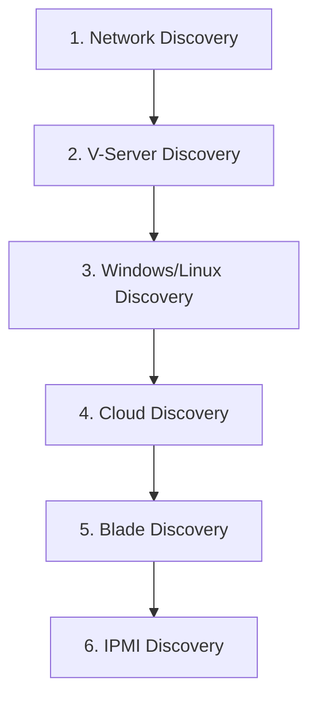
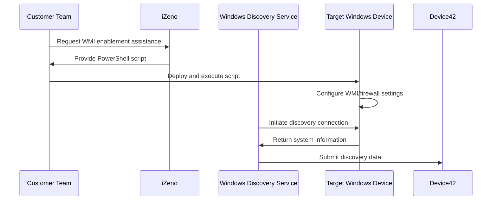
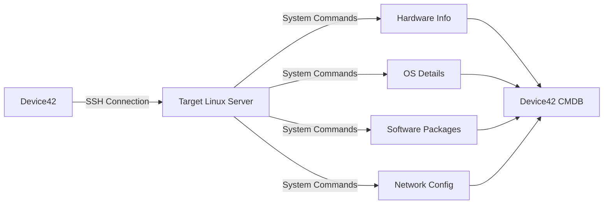

# Device42 On-Premise Discovery Implementation Guide

**Prepared by:** iZeno  
**Version:** 1.0  

## Table of Contents

1. [Executive Summary](#executive-summary)
2. [Discovery Overview](#discovery-overview)
3. [Prerequisites and System Requirements](#prerequisites-and-system-requirements)
4. [Discovery Implementation Sequence](#discovery-implementation-sequence)
5. [Network Device Discovery (SNMP)](#network-device-discovery-snmp)
6. [Windows Device Discovery](#windows-device-discovery)
7. [Linux/Unix Device Discovery](#linuxunix-device-discovery)
8. [Discovery Hub Quick Assessment](#discovery-hub-quick-assessment)
9. [Best Practices and Recommendations](#best-practices-and-recommendations)
10. [Responsibilities Matrix](#responsibilities-matrix)
11. [Troubleshooting](#troubleshooting)
12. [Appendices](#appendices)

---

## Executive Summary

This guide provides a comprehensive approach to implementing Device42's autodiscovery capabilities for on-premise infrastructure. Device42 automates the discovery of IT assets through agentless methods, building an accurate Configuration Management Database (CMDB) with minimal network impact.

**Key Benefits:**
- Agentless discovery reduces security concerns and administrative overhead
- Automated data collection ensures CMDB accuracy and currency
- Comprehensive asset visibility across network, server, and virtualization layers
- Scheduled discovery maintains data freshness

---

## Discovery Overview

### Discovery Capabilities

Device42 supports multiple discovery methods:

| Discovery Type | Protocol | Target Assets | Information Collected |
|---|---|---|---|
| **Network (SNMP)** | SNMP v1/v2c/v3 | Switches, Routers, Firewalls | Network topology, VLANs, MAC tables, switch ports |
| **Windows** | WMI/WinRM | Windows Servers/Workstations | Hardware specs, OS details, installed software, services |
| **Linux/Unix** | SSH | Linux/Unix Servers | Hardware specs, OS details, installed packages, services |
| **Hypervisor** | API/SSH | VMware, Hyper-V, KVM | Virtual machines, resource allocation, hypervisor details |
| **Cloud** | API | AWS, Azure, GCP | Cloud instances, storage, network configurations |

### Discovery Architecture

```
┌─────────────────┐    ┌─────────────────┐    ┌─────────────────┐
│   Main          │    │   Remote        │    │   Windows       │
│   Appliance     │◄──►│   Collector     │◄──►│   Discovery     │
│   (MA)          │    │   (RC)          │    │   Service (WDS) │
└─────────────────┘    └─────────────────┘    └─────────────────┘
         │                       │                       │
         ▼                       ▼                       ▼
┌─────────────────┐    ┌─────────────────┐    ┌─────────────────┐
│   Target        │    │   Target        │    │   Target        │
│   Devices       │    │   Devices       │    │   Windows       │
│                 │    │                 │    │   Devices       │
└─────────────────┘    └─────────────────┘    └─────────────────┘
```

---

## Prerequisites and System Requirements

### Device42 Appliance Requirements

**Minimum Configuration:**
- 4 vCPUs
- 8 GB RAM
- 1 Gbps network connection
- Dedicated resource pool (no resource contention)
- SSD storage (recommended)

### Network Requirements

**Required Ports and Protocols:**

| Port | Protocol | Purpose | Direction |
|---|---|---|---|
| 161 | UDP | SNMP Discovery | MA/RC → Targets |
| 22 | TCP | SSH (*nix Discovery) | MA/RC → Targets |
| 135, 445 | TCP | WMI Discovery | WDS → Targets |
| 5985, 5986 | TCP | WinRM Discovery | MA/RC → Targets |
| 443 | TCP | API Communication | MA ↔ RC/WDS |
| 623 | UDP | IPMI Discovery | MA/RC → Targets |

### Security Considerations

⚠️ **Critical Security Notice:**
- **NEVER** use production administrative accounts for discovery
- Create dedicated service accounts with minimal required permissions
- Implement account lockout protections to prevent service disruptions
- Test discovery in non-production environments first

---

## Discovery Implementation Sequence

### Recommended Implementation Order

Device42 recommends the following sequence to minimize reconciliation efforts:



**Rationale:**
1. **Network Discovery** establishes the foundation by mapping network topology
2. **Hypervisor Discovery** identifies virtualization infrastructure
3. **OS Discovery** provides detailed server information
4. **Specialized Discovery** fills in remaining gaps

### Device Matching Logic

Device42 matches devices using the following hierarchy:
1. **Serial Number** (primary identifier)
2. **UUID** (secondary identifier)
3. **Device Name** (tertiary identifier)
4. **Aliases** (if configured)

This matching prevents duplicate device creation across different discovery methods.

---

## Network Device Discovery (SNMP)

### Overview

SNMP discovery builds your Layer 2 network landscape and discovers network devices, VLANs, subnets, IP addresses, and MAC address tables.

### Customer Responsibilities

🔧 **Network Team Tasks:**
- Enable SNMP protocol on target network devices
- Configure SNMP community strings or v3 credentials
- Ensure firewall rules allow UDP/161 from Device42 appliances
- Consult with hardware vendors for device-specific SNMP configuration

### Supported Vendors

Device42 supports 100+ network equipment vendors including:
- **Major Vendors:** Cisco, Juniper, HP/HPE, Dell, Arista, Extreme Networks
- **Security Vendors:** Palo Alto, Fortinet, Check Point, SonicWall
- **Wireless Vendors:** Aruba, Ruckus, Ubiquiti, Meraki

*See Appendix A for complete vendor list*

### SNMP Configuration Steps

1. **Create SNMP Discovery Job**
   - Navigate to Discovery > SNMP
   - Specify target IP ranges or individual devices
   - Configure SNMP credentials (community strings or v3)

2. **Discovery Options**
   - Enable "Run Autodiscovery on CDP/LLDP Neighbors"
   - Configure "Get all Switch Ports" for complete port inventory
   - Set MAC address aging policies

3. **Best Practices**
   - Start with core network devices
   - Use read-only SNMP community strings
   - Test with single devices before bulk discovery

### Expected Results

- Network device inventory (switches, routers, firewalls)
- Network topology and port connectivity
- VLAN and subnet mappings
- MAC address tables and ARP entries
- Switch port utilization and status

---

## Windows Device Discovery

### Overview

Windows discovery collects comprehensive information from Windows servers and workstations using WMI or WinRM protocols.

### iZeno Services

🛠️ **iZeno Provides:**
- **PowerShell WMI Enablement Script** - Automates WMI configuration on target Windows devices
- Script testing and validation
- Implementation guidance and best practices

### Customer Responsibilities

📋 **Customer Tasks:**
- Deploy WMI enablement script to target devices
- Choose deployment method:
  - Individual execution on each device
  - Bulk deployment via SCCM, Group Policy, or other management tools
- Create dedicated service accounts with appropriate permissions
- Configure firewall rules for WMI/WinRM access

### Implementation Options

#### Option 1: WMI Discovery (Default)
- **Protocol:** WMI over DCOM
- **Ports:** TCP 135, 445, dynamic RPC ports
- **Requirements:** Windows Discovery Service (WDS) installation
- **Advantages:** Comprehensive data collection, proven reliability

#### Option 2: WinRM Discovery
- **Protocol:** WinRM over HTTP/HTTPS
- **Ports:** TCP 5985 (HTTP), 5986 (HTTPS)
- **Requirements:** WinRM enabled on targets
- **Advantages:** Microsoft's preferred protocol, simplified firewall configuration

### Windows Discovery Process



### Permission Requirements

**Minimum Account Permissions:**
- Member of "Performance Monitor Users" group
- Member of "Distributed COM Users" group
- WMI namespace permissions (CIMV2, StandardCimv2, default)
- For Hyper-V: Member of "Hyper-V Administrators" group

### Expected Results

- Hardware inventory (CPU, memory, storage)
- Operating system details and patch levels
- Installed software and applications
- Running services and processes
- Network interface configurations
- Application dependencies (with ADM enabled)

---

## Linux/Unix Device Discovery

### Overview

Linux/Unix discovery uses SSH connections to collect comprehensive system information from Linux and Unix servers.

### Customer Responsibilities

🔧 **System Administration Tasks:**
- Ensure SSH service is running on target systems (port 22)
- Create discovery service accounts with appropriate permissions
- Configure sudo access for hardware discovery commands
- Distribute SSH keys (if using key-based authentication)
- Configure firewall rules to allow SSH from Device42 appliances

### Supported Operating Systems

- Red Hat Enterprise Linux / CentOS / Fedora
- Ubuntu / Debian
- SUSE Linux Enterprise / openSUSE
- Oracle Linux
- AIX, Solaris, HP-UX
- FreeBSD, OpenBSD
- macOS

### Authentication Methods

#### Option 1: Password Authentication
- Standard username/password credentials
- Simpler setup but less secure
- Requires password management

#### Option 2: SSH Key Authentication
- Public/private key pairs
- Enhanced security
- Automated authentication without passwords

### Linux Discovery Process



### Required Commands and Permissions

Key commands that require elevated privileges:

| Command | Purpose | Sudo Required |
|---|---|---|
| `dmidecode` | Hardware information | Yes |
| `lspci` | PCI device information | Yes |
| `fdisk -l` | Disk information | Yes |
| `lsof` | Process and network information | Yes |
| `systemctl` | Service information | Sometimes |

### sudo Configuration Example

```bash
# Add to /etc/sudoers
discovery_user ALL = (ALL) NOPASSWD: /usr/sbin/dmidecode, /sbin/lspci, /sbin/fdisk, /usr/bin/lsof
```

### Expected Results

- Hardware specifications and serial numbers
- Operating system versions and kernel information
- Installed packages and software versions
- Network interface configurations
- Running processes and services
- Application configurations and dependencies

---

## Discovery Hub Quick Assessment

### Overview

Discovery Hub provides rapid network assessment capabilities to quickly understand your environment before setting up detailed discovery jobs.

### Use Cases

- **Initial Environment Assessment** - Understand device distribution before detailed discovery
- **Network Scoping** - Identify device types and quantities for licensing planning
- **Discovery Planning** - Determine optimal discovery job configurations

### Implementation Steps

1. **Configure Network Scan**
   - Specify IP ranges or CIDR blocks
   - Select Remote Collector
   - Configure scan speed (fast/moderate/normal)

2. **Review Results by Category**
   - Windows devices
   - Linux/Unix devices
   - Network devices
   - Hypervisors
   - Other/Unknown devices
   - Unreachable targets

3. **Convert to Discovery Jobs**
   - Select device categories for detailed discovery
   - Configure credentials and settings
   - Schedule regular discovery execution

### Best Practices

- Run one scan at a time initially
- Use moderate or normal scan speeds for accuracy
- Review unknown devices for potential miscategorization
- Use results to plan discovery job configurations

---

## Best Practices and Recommendations

### Discovery Scheduling

**Frequency Guidelines:**
- **Network Discovery:** Daily to weekly (based on network change rate)
- **Server Discovery:** Weekly to monthly (based on server change rate)
- **Hypervisor Discovery:** Daily to weekly (for dynamic environments)

**Timing Considerations:**
- Schedule during low-traffic periods
- Stagger discovery jobs to prevent network congestion
- Allow adequate time for job completion

### Performance Optimization

**Network Impact Minimization:**
- Discovery only collects inventory data (minimal bandwidth)
- Use Remote Collectors to distribute load
- Implement discovery exclusions for irrelevant targets

**Scalability Recommendations:**
- Deploy multiple Remote Collectors for large environments
- Use dedicated WDS instances for Windows-heavy environments
- Implement credential caching for improved performance

### Data Quality Management

**Duplicate Prevention:**
- Consistent device naming conventions
- Proper hostname/FQDN configuration
- Regular data reconciliation reviews

**Accuracy Maintenance:**
- Regular discovery scheduling
- Prompt investigation of discovery failures
- Periodic validation of discovered data

### Security Best Practices

**Account Management:**
- Use dedicated service accounts with minimal privileges
- Implement account rotation policies
- Monitor account usage and access patterns

**Network Security:**
- Restrict discovery traffic to necessary ports
- Use encrypted protocols where possible (WinRM HTTPS, SSH)
- Implement network segmentation for discovery traffic

---

## Responsibilities Matrix

| Task Category | iZeno Responsibilities | Customer Responsibilities |
|---|---|---|
| **Planning** | • Discovery strategy guidance<br>• Best practices recommendations<br>• Implementation planning | • Environment assessment<br>• Business requirements definition<br>• Resource allocation |
| **Windows Discovery** | • PowerShell script provision<br>• WMI configuration guidance<br>• Testing assistance | • Script deployment (individual/bulk)<br>• Service account creation<br>• Firewall configuration |
| **Network Discovery** | • SNMP job configuration<br>• Discovery optimization<br>• Results analysis | • SNMP enablement on devices<br>• Community string management<br>• Network team coordination |
| **Linux Discovery** | • SSH configuration guidance<br>• Permission optimization<br>• Discovery job setup | • SSH access configuration<br>• Service account creation<br>• sudo permissions setup |
| **Support** | • Discovery troubleshooting<br>• Performance optimization<br>• Best practices guidance | • Infrastructure management<br>• Credential management<br>• Change coordination |

---

## Troubleshooting

### Common Issues and Solutions

#### Windows Discovery Issues

**Problem:** WMI Access Denied
- **Solution:** Verify service account permissions and WMI namespace access
- **iZeno Assistance:** PowerShell script validation and permission verification

**Problem:** Firewall Blocking Discovery
- **Solution:** Configure Windows Firewall rules for WMI/WinRM traffic
- **Ports:** TCP 135, 445 (WMI) or TCP 5985, 5986 (WinRM)

#### Network Discovery Issues

**Problem:** SNMP Timeout or Access Denied
- **Solution:** Verify SNMP configuration and community strings
- **Customer Action:** Coordinate with network team for SNMP enablement

**Problem:** Incomplete Device Information
- **Solution:** Verify SNMP permissions and MIB availability
- **Customer Action:** Consult vendor documentation for complete SNMP configuration

#### Linux Discovery Issues

**Problem:** SSH Connection Refused
- **Solution:** Verify SSH service status and firewall configuration
- **Customer Action:** Enable SSH service and configure firewall rules

**Problem:** Permission Denied for Hardware Commands
- **Solution:** Configure sudo permissions for discovery commands
- **Customer Action:** Implement appropriate sudoers configuration

### Discovery Job Monitoring

**Job Status Locations:**
- Discovery job edit pages (individual job status)
- Analytics > Jobs Dashboard (real-time monitoring)
- Analytics > Completed Jobs (historical results)

**Key Metrics to Monitor:**
- Job completion time
- Success/failure rates
- Device discovery counts
- Error message patterns

---

## Appendices

### Appendix A: Supported SNMP Vendors

**Network Equipment Vendors:**
3Com, A10 Networks, ADTRAN, Aerohive, Alcatel, Allied, APC, Arista, Aruba, Avaya, Barracuda, Brocade, Cisco, Citrix, Dell, ExtremeNetworks, F5, Fortinet, HP/HPE, Huawei, IBM, Juniper, NETGEAR, Palo Alto, SonicWall, VMware, and 70+ additional vendors.

### Appendix B: Port Reference Matrix

| Discovery Type | Ports | Protocol | Direction |
|---|---|---|---|
| SNMP | 161 | UDP | MA/RC → Targets |
| SSH | 22 | TCP | MA/RC → Targets |
| WMI | 135, 445, RPC | TCP | WDS → Targets |
| WinRM | 5985, 5986 | TCP | MA/RC → Targets |
| IPMI | 623 | UDP | MA/RC → Targets |
| Device42 API | 443 | TCP | MA ↔ RC/WDS |

<!-- ### Appendix C: iZeno Contact Information

**Technical Support:**
- Support Portal: [Customer Portal URL]
- Email: support@izeno.com
- Phone: [Support Phone Number]

**Project Management:**
- Project Manager: [PM Name]
- Email: [PM Email]
- Phone: [PM Phone]

---

**Document Control:**
- **Created:** [Date]
- **Last Updated:** [Date]
- **Version:** 1.0
- **Next Review:** [Date + 3 months] -->

<!-- *This document contains confidential and proprietary information. Distribution is restricted to authorized personnel only.* -->