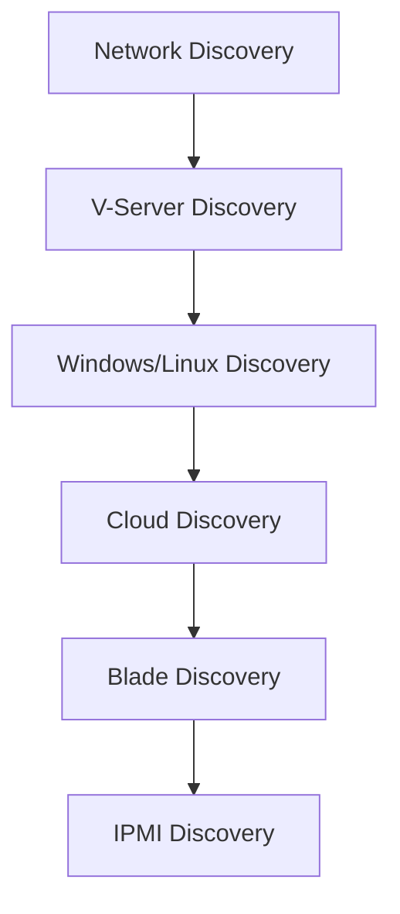
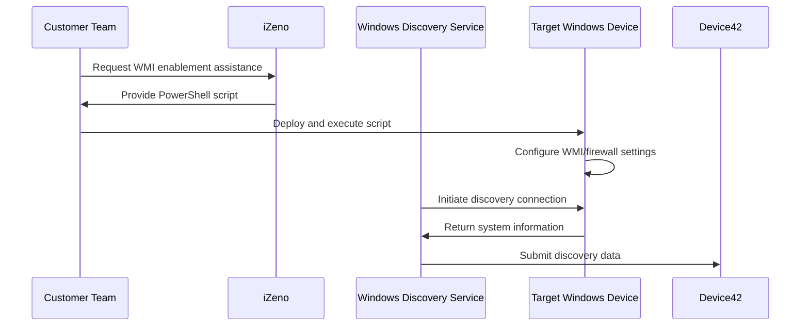
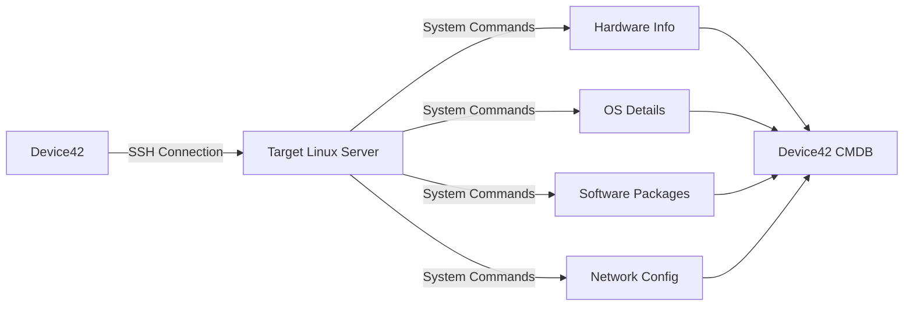

# Device42 On-Premise Discovery Implementation Guide

**Prepared by:** iZeno  
**Version:** 1.0  
**Device42 Documentation:** [Device42 Knowledge Base](https://docs.device42.com/)

## Table of Contents

1. [Executive Summary](#executive-summary)
2. [Discovery Overview](#discovery-overview)
3. [Prerequisites and System Requirements](#prerequisites-and-system-requirements)
4. [Discovery Implementation Sequence](#discovery-implementation-sequence)
5. [Network Device Discovery (SNMP)](#network-device-discovery-snmp)
6. [Windows Device Discovery](#windows-device-discovery)
7. [Linux/Unix Device Discovery](#linuxunix-device-discovery)
8. [Discovery Hub Quick Assessment](#discovery-hub-quick-assessment)
9. [Best Practices and Recommendations](#best-practices-and-recommendations)
10. [Responsibilities Matrix](#responsibilities-matrix)
11. [Troubleshooting](#troubleshooting)
12. [Appendices](#appendices)

---

## Executive Summary

This guide provides an approach to implementing Device42's autodiscovery capabilities for on-premise infrastructure. Device42 automates the discovery of IT assets through agentless methods, building an accurate Configuration Management Database (CMDB) with minimal network impact.

**Additional Resources:**
- [Device42 Discovery Guide](https://docs.device42.com/auto-discovery/)
- [Device42 Best Practices](https://docs.device42.com/administration/best-practices/)

---

## Discovery Overview

### Discovery Capabilities

Device42 supports multiple discovery methods:

| Discovery Type | Protocol | Target Assets | Information Collected | Documentation |
|---|---|---|---|---|
| **Network (SNMP)** | SNMP v1/v2c/v3 | Switches, Routers, Firewalls | Network topology, VLANs, MAC tables, switch ports | [SNMP Discovery Guide](https://docs.device42.com/auto-discovery/network-auto-discovery/) |
| **Windows** | WMI/WinRM | Windows Servers/Workstations | Hardware specs, OS details, installed software, services | [Windows Discovery Guide](https://docs.device42.com/auto-discovery/windows-and-hyper-v-auto-discovery/) |
| **Linux/Unix** | SSH | Linux/Unix Servers | Hardware specs, OS details, installed packages, services | [Linux/Unix Discovery Guide](https://docs.device42.com/auto-discovery/linux-unix-server-auto-discovery/) |
| **Hypervisor** | API/SSH | VMware, Hyper-V, KVM | Virtual machines, resource allocation, hypervisor details | [Hypervisor Discovery Guide](https://docs.device42.com/auto-discovery/virtualization-auto-discovery/) |
| **Cloud** | API | AWS, Azure, GCP | Cloud instances, storage, network configurations | [Cloud Discovery Guide](https://docs.device42.com/auto-discovery/cloud-auto-discovery/) |

### Discovery Architecture

```
┌─────────────────┐    ┌─────────────────┐    ┌─────────────────┐
│   Main          │    │   Remote        │    │   Windows       │
│   Appliance     │◄──►│   Collector     │◄──►│   Discovery     │
│   (MA)          │    │   (RC)          │    │   Service (WDS) │
└─────────────────┘    └─────────────────┘    └─────────────────┘
         │                       │                       │
         ▼                       ▼                       ▼
┌─────────────────┐    ┌─────────────────┐    ┌─────────────────┐
│   Target        │    │   Target        │    │   Target        │
│   Devices       │    │   Devices       │    │   Windows       │
│                 │    │                 │    │   Devices       │
└─────────────────┘    └─────────────────┘    └─────────────────┘
```

---

## Prerequisites and System Requirements

### Network Requirements

**Required Ports and Protocols:**

*See Appendix B for complete port reference matrix with detailed configurations*

| Port | Protocol | Purpose | Direction |
|---|---|---|---|
| 161 | UDP | SNMP Discovery | RC → Targets |
| 22 | TCP | SSH (*nix Discovery) | RC → Targets |
| 135, 445 | TCP | WMI Discovery | WDS → Targets |
| 5985, 5986 | TCP | WinRM Discovery | WDS → Targets |
| 443 | TCP | API Communication | MA ↔ RC/WDS |
| 623 | UDP | IPMI Discovery | RC → Targets |

### Security Considerations

⚠️ **Critical Security Notice:**
- **NEVER** use production administrative accounts for discovery
- Create dedicated service accounts with minimal required permissions
- Implement account lockout protections to prevent service disruptions
- Test discovery in non-production environments first

**Security Resources:**
- [Device42 Security Best Practices](https://docs.device42.com/administration/security-best-practices/)
- [Service Account Configuration Guide](https://docs.device42.com/auto-discovery/service-account-permissions/)

---

## Discovery Implementation Sequence

### Recommended Implementation Order

Device42 recommends the following sequence to minimize reconciliation efforts:



**Rationale:**
1. **Network Discovery** establishes the foundation by mapping network topology
2. **Hypervisor Discovery** identifies virtualization infrastructure
3. **OS Discovery** provides detailed server information
4. **Specialized Discovery** fills in remaining gaps

### Device Matching Logic

Device42 matches devices using the following hierarchy:
1. **Serial Number** (primary identifier)
2. **UUID** (secondary identifier)
3. **Device Name** (tertiary identifier)
4. **Aliases** (if configured)

This matching prevents duplicate device creation across different discovery methods.

---

## Network Device Discovery (SNMP)

### Overview

SNMP discovery builds your Layer 2 network landscape and discovers network devices, VLANs, subnets, IP addresses, and MAC address tables.

### Customer Responsibilities

🔧 **Network Team Tasks:**
- Enable SNMP protocol on target network devices
- Configure SNMP community strings or v3 credentials
- Ensure firewall rules allow UDP/161 from Device42 appliances
- Consult with hardware vendors for device-specific SNMP configuration

### Supported Vendors

Device42 supports 100+ network equipment vendors including:
- **Major Vendors:** [Cisco](https://www.cisco.com/c/en/us/support/docs/ip/simple-network-management-protocol-snmp/7282-12.html), [Juniper](https://www.juniper.net/documentation/us/en/software/junos/network-mgmt/topics/topic-map/snmp-monitoring-managing.html), [HP/HPE](https://support.hpe.com/hpesc/public/docDisplay?docId=c04111765), [Dell](https://www.dell.com/support/kbdoc/en-us/000123074/how-to-configure-snmp-on-dell-networking-switches), [Arista](https://www.arista.com/en/um-eos/eos-network-management-snmp), [Extreme Networks](https://documentation.extremenetworks.com/exos/EXOS_31.7/Content/EXOS_Concepts/SNMP/SNMP_Overview.htm)
- **Security Vendors:** [Palo Alto](https://docs.paloaltonetworks.com/pan-os/9-1/pan-os-admin/monitoring/use-snmp-monitoring), [Fortinet](https://docs.fortinet.com/document/fortigate/7.0.0/administration-guide/25270/snmp), [Check Point](https://sc1.checkpoint.com/documents/R81/WebAdminGuides/EN/CP_R81_Gaia_AdminGuide/Topics-GAG/SNMP.htm), [SonicWall](https://www.sonicwall.com/support/knowledge-base/how-to-configure-snmp-on-sonicwall-firewalls/170505754167071/)
- **Wireless Vendors:** [Aruba](https://www.arubanetworks.com/techdocs/ArubaOS_86_Web_Help/Content/arubaos-solutions/snmp/snmp-overview.htm), [Ruckus](https://docs.commscope.com/bundle/fastiron-08095-adminguide/page/GUID-C0C6D3D9-7B7F-4A8E-9B4B-8C8A2F8E8C8A.html), [Ubiquiti](https://help.ui.com/hc/en-us/articles/204976244-UniFi-SNMP-Information), [Meraki](https://documentation.meraki.com/General_Administration/Monitoring_and_Reporting/SNMP_Overview_and_Configuration)

*See [Appendix A](#appendix-a-supported-snmp-vendors) for complete vendor list with configuration links*

### SNMP Configuration Steps

1. **Create SNMP Discovery Job**
   - Navigate to Discovery > SNMP
   - Specify target IP ranges or individual devices
   - Configure SNMP credentials (community strings or v3)
   - [SNMP Configuration Guide](https://docs.device42.com/auto-discovery/network-auto-discovery/snmp-discovery/)

2. **Discovery Options**
   - Enable "Run Autodiscovery on CDP/LLDP Neighbors"
   - Configure "Get all Switch Ports" for complete port inventory
   - Set MAC address aging policies
   - [Advanced SNMP Options](https://docs.device42.com/auto-discovery/network-auto-discovery/snmp-discovery-advanced-options/)

3. **Best Practices**
   - Start with core network devices
   - Use read-only SNMP community strings
   - Test with single devices before bulk discovery

### Expected Results

- Network device inventory (switches, routers, firewalls)
- Network topology and port connectivity
- VLAN and subnet mappings
- MAC address tables and ARP entries
- Switch port utilization and status

---

## Windows Device Discovery

### Overview

Windows discovery collects comprehensive information from Windows servers and workstations using WMI or WinRM protocols.

### iZeno Services

🛠️ **iZeno Provides:**
- **PowerShell WMI Enablement Script** - Automates WMI configuration on target Windows devices
- Script testing and validation
- Implementation guidance and best practices

**Related Resources:**
- [Device42 WMI Configuration Guide](https://docs.device42.com/auto-discovery/windows-and-hyper-v-auto-discovery/wmi-based-discovery/)
- [PowerShell WMI Commands Reference](https://docs.microsoft.com/en-us/powershell/module/microsoft.powershell.management/get-wmiobject)

### Customer Responsibilities

📋 **Customer Tasks:**
- Deploy WMI enablement script to target devices
- Choose deployment method:
  - Individual execution on each device
  - Bulk deployment via [SCCM](https://docs.microsoft.com/en-us/mem/configmgr/), [Group Policy](https://docs.microsoft.com/en-us/troubleshoot/windows-server/group-policy/create-and-manage-group-policy), or other management tools
- Create dedicated service accounts with appropriate permissions
- Configure firewall rules for WMI/WinRM access

### Implementation Options

#### Option 1: WMI Discovery (Default)
- **Protocol:** WMI over DCOM
- **Ports:** TCP 135, 445, dynamic RPC ports
- **Requirements:** Windows Discovery Service (WDS) installation
- **Advantages:** Comprehensive data collection, proven reliability
- **Configuration Guide:** [WMI Discovery Setup](https://docs.device42.com/auto-discovery/windows-and-hyper-v-auto-discovery/wmi-based-discovery/)

#### Option 2: WinRM Discovery
- **Protocol:** WinRM over HTTP/HTTPS
- **Ports:** TCP 5985 (HTTP), 5986 (HTTPS)
- **Requirements:** WinRM enabled on targets
- **Advantages:** Microsoft's preferred protocol, simplified firewall configuration
- **Configuration Guide:** [WinRM Discovery Setup](https://docs.device42.com/auto-discovery/windows-and-hyper-v-auto-discovery/winrm-based-discovery/)

### Windows Discovery Process



### Permission Requirements

**Minimum Account Permissions:**
- Member of "Performance Monitor Users" group
- Member of "Distributed COM Users" group
- WMI namespace permissions (CIMV2, StandardCimv2, default)
- For Hyper-V: Member of "Hyper-V Administrators" group

### Expected Results

- Hardware inventory (CPU, memory, storage)
- Operating system details and patch levels
- Installed software and applications
- Running services and processes
- Network interface configurations
- Application dependencies (with ADM enabled)

---

## Linux/Unix Device Discovery

### Overview

Linux/Unix discovery uses SSH connections to collect comprehensive system information from Linux and Unix servers.

### Customer Responsibilities

🔧 **System Administration Tasks:**
- Ensure SSH service is running on target systems (port 22)
- Create discovery service accounts with appropriate permissions
- Configure sudo access for hardware discovery commands
- Distribute SSH keys (if using key-based authentication)
- Configure firewall rules to allow SSH from Device42 appliances

### Supported Operating Systems

- [Red Hat Enterprise Linux](https://access.redhat.com/documentation/en-us/red_hat_enterprise_linux/8/html/configuring_and_managing_security/using-the-system-wide-cryptographic-policies_configuring-and-managing-security) / [CentOS](https://docs.centos.org/en-US/centos/install-guide/) / [Fedora](https://docs.fedoraproject.org/en-US/fedora/latest/system-administrators-guide/)
- [Ubuntu](https://ubuntu.com/server/docs) / [Debian](https://www.debian.org/doc/)
- [SUSE Linux Enterprise](https://documentation.suse.com/sles/) / [openSUSE](https://doc.opensuse.org/)
- [Oracle Linux](https://docs.oracle.com/en/operating-systems/oracle-linux/)
- [AIX](https://www.ibm.com/docs/en/aix), [Solaris](https://docs.oracle.com/en/operating-systems/solaris/), [HP-UX](https://support.hpe.com/hpesc/public/docDisplay?docId=c04111765)
- [FreeBSD](https://www.freebsd.org/doc/), [OpenBSD](https://www.openbsd.org/faq/)
- [macOS](https://support.apple.com/guide/mac-help/welcome/mac)

### Authentication Methods

#### Option 1: Password Authentication
- Standard username/password credentials
- Simpler setup but less secure
- Requires password management
- [SSH Password Authentication Guide](https://www.ssh.com/academy/ssh/password-authentication)

#### Option 2: SSH Key Authentication
- Public/private key pairs
- Enhanced security
- Automated authentication without passwords
- [SSH Key Authentication Guide](https://www.ssh.com/academy/ssh/public-key-authentication)

### Linux Discovery Process



### Required Commands and Permissions

Key commands that require elevated privileges:

| Command | Purpose | Sudo Required |
|---|---|---|
| `dmidecode` | Hardware information | Yes |
| `lspci` | PCI device information | Yes |
| `fdisk -l` | Disk information | Yes |
| `lsof` | Process and network information | Yes |
| `systemctl` | Service information | Sometimes |

### sudo Configuration Example

```bash
# Add to /etc/sudoers
# Reference: https://www.sudo.ws/docs/man/1.8.15/sudoers.man/
discovery_user ALL = (ALL) NOPASSWD: /usr/sbin/dmidecode, /sbin/lspci, /sbin/fdisk, /usr/bin/lsof
```

**sudo Configuration Resources:**
- [sudo Manual](https://www.sudo.ws/docs/man/1.8.15/sudoers.man/)
- [Linux sudo Best Practices](https://www.redhat.com/sysadmin/sudo-security)

### Expected Results

- Hardware specifications and serial numbers
- Operating system versions and kernel information
- Installed packages and software versions
- Network interface configurations
- Running processes and services
- Application configurations and dependencies

---

## Discovery Hub Quick Assessment

### Overview

Discovery Hub provides rapid network assessment capabilities to quickly understand your environment before setting up detailed discovery jobs.

### Use Cases

- **Initial Environment Assessment** - Understand device distribution before detailed discovery
- **Network Scoping** - Identify device types and quantities for licensing planning
- **Discovery Planning** - Determine optimal discovery job configurations

**Documentation:**
- [Discovery Hub Guide](https://docs.device42.com/auto-discovery/discovery-hub/)
- [Network Assessment Best Practices](https://docs.device42.com/auto-discovery/network-auto-discovery/network-assessment/)

### Implementation Steps

1. **Configure Network Scan**
   - Specify IP ranges or CIDR blocks
   - Select Remote Collector
   - Configure scan speed (fast/moderate/normal)

2. **Review Results by Category**
   - Windows devices
   - Linux/Unix devices
   - Network devices
   - Hypervisors
   - Other/Unknown devices
   - Unreachable targets

3. **Convert to Discovery Jobs**
   - Select device categories for detailed discovery
   - Configure credentials and settings
   - Schedule regular discovery execution

### Best Practices

- Run one scan at a time initially
- Use moderate or normal scan speeds for accuracy
- Review unknown devices for potential miscategorization
- Use results to plan discovery job configurations

---

## Best Practices and Recommendations

### Discovery Scheduling

**Frequency Guidelines:**
- **Network Discovery:** Daily to weekly (based on network change rate)
- **Server Discovery:** Weekly to monthly (based on server change rate)
- **Hypervisor Discovery:** Daily to weekly (for dynamic environments)

**Timing Considerations:**
- Schedule during low-traffic periods
- Stagger discovery jobs to prevent network congestion
- Allow adequate time for job completion

### Performance Optimization

**Network Impact Minimization:**
- Discovery only collects inventory data (minimal bandwidth)
- Use Remote Collectors to distribute load
- Implement discovery exclusions for irrelevant targets

**Performance Guides:**
- [Device42 Performance Optimization](https://docs.device42.com/administration/performance-optimization/)
- [Remote Collector Deployment Guide](https://docs.device42.com/auto-discovery/remote-collector-rc/)

**Scalability Recommendations:**
- Deploy multiple Remote Collectors for large environments
- Use dedicated WDS instances for Windows-heavy environments
- Implement credential caching for improved performance

**Scalability Resources:**
- [Device42 Scalability Guide](https://docs.device42.com/administration/scalability/)
- [Multi-Collector Architecture](https://docs.device42.com/auto-discovery/remote-collector-rc/multi-collector-setup/)

### Data Quality Management

**Duplicate Prevention:**
- Consistent device naming conventions
- Proper hostname/FQDN configuration
- Regular data reconciliation reviews

**Accuracy Maintenance:**
- Regular discovery scheduling
- Prompt investigation of discovery failures
- Periodic validation of discovered data

### Security Best Practices

**Account Management:**
- Use dedicated service accounts with minimal privileges
- Implement account rotation policies
- Monitor account usage and access patterns

**Network Security:**
- Restrict discovery traffic to necessary ports
- Use encrypted protocols where possible (WinRM HTTPS, SSH)
- Implement network segmentation for discovery traffic

---

## Responsibilities Matrix

| Task Category | iZeno Responsibilities | Customer Responsibilities |
|---|---|---|
| **Planning** | • Discovery strategy guidance<br>• Best practices recommendations<br>• Implementation planning | • Environment assessment<br>• Business requirements definition<br>• Resource allocation |
| **Windows Discovery** | • PowerShell script provision<br>• WMI configuration guidance<br>• Testing assistance | • Script deployment (individual/bulk)<br>• Service account creation<br>• Firewall configuration |
| **Network Discovery** | • SNMP job configuration<br>• Results analysis | • SNMP enablement on devices<br>• Community string management<br>• Network team coordination |
| **Linux Discovery** | • SSH configuration guidance<br>• Permission optimization<br>• Discovery job setup | • SSH access configuration<br>• Service account creation<br>• sudo permissions setup |
| **Support** | • Discovery troubleshooting<br>• Best practices guidance | • Infrastructure management<br>• Credential management<br>• Change coordination |

---

## Troubleshooting

### Common Issues and Solutions

#### Windows Discovery Issues

**Problem:** WMI Access Denied
- **Solution:** Verify service account permissions and WMI namespace access
- **iZeno Assistance:** PowerShell script validation and permission verification
- **Microsoft Documentation:** [WMI Troubleshooting](https://docs.microsoft.com/en-us/windows/win32/wmisdk/wmi-troubleshooting)

**Problem:** Firewall Blocking Discovery
- **Solution:** Configure Windows Firewall rules for WMI/WinRM traffic
- **Ports:** TCP 135, 445 (WMI) or TCP 5985, 5986 (WinRM)
- **Microsoft Documentation:** [Windows Firewall with Advanced Security](https://docs.microsoft.com/en-us/windows/security/threat-protection/windows-firewall/windows-firewall-with-advanced-security)

#### Network Discovery Issues

**Problem:** SNMP Timeout or Access Denied
- **Solution:** Verify SNMP configuration and community strings
- **Customer Action:** Coordinate with network team for SNMP enablement
- **SNMP Troubleshooting:** [Net-SNMP Troubleshooting Guide](http://www.net-snmp.org/docs/FAQ.html)

**Problem:** Incomplete Device Information
- **Solution:** Verify SNMP permissions and MIB availability
- **Customer Action:** Consult vendor documentation for complete SNMP configuration
- **MIB Resources:** [SNMP MIB Database](https://www.oidview.com/mibs/detail.html)

#### Linux Discovery Issues

**Problem:** SSH Connection Refused
- **Solution:** Verify SSH service status and firewall configuration
- **Customer Action:** Enable SSH service and configure firewall rules
- **SSH Troubleshooting:** [OpenSSH Troubleshooting Guide](https://www.openssh.com/faq.html)

**Problem:** Permission Denied for Hardware Commands
- **Solution:** Configure sudo permissions for discovery commands
- **Customer Action:** Implement appropriate sudoers configuration
- **sudo Troubleshooting:** [sudo Troubleshooting Guide](https://www.sudo.ws/docs/troubleshooting/)

### Discovery Job Monitoring

**Job Status Locations:**
- Discovery job edit pages (individual job status)
- Analytics > Jobs Dashboard (real-time monitoring)
- Analytics > Completed Jobs (historical results)

**Monitoring Resources:**
- [Device42 Discovery Monitoring](https://docs.device42.com/auto-discovery/discovery-monitoring/)
- [Analytics Dashboard Guide](https://docs.device42.com/reports/analytics-dashboard/)

**Key Metrics to Monitor:**
- Job completion time
- Success/failure rates
- Device discovery counts
- Error message patterns

---

## Appendices

### Appendix A: Supported SNMP Vendors

**Network Equipment Vendors with Configuration Links:**

#### Major Network Vendors:
- **Cisco:** [SNMP Configuration Guide](https://www.cisco.com/c/en/us/support/docs/ip/simple-network-management-protocol-snmp/7282-12.html)
- **Juniper:** [SNMP Configuration](https://www.juniper.net/documentation/us/en/software/junos/network-mgmt/topics/topic-map/snmp-monitoring-managing.html)
- **HP/HPE:** [SNMP Configuration](https://support.hpe.com/hpesc/public/docDisplay?docId=c04111765)
- **Dell:** [SNMP Configuration](https://www.dell.com/support/kbdoc/en-us/000123074/how-to-configure-snmp-on-dell-networking-switches)
- **Arista:** [SNMP Configuration](https://www.arista.com/en/um-eos/eos-network-management-snmp)
- **Extreme Networks:** [SNMP Configuration](https://documentation.extremenetworks.com/exos/EXOS_31.7/Content/EXOS_Concepts/SNMP/SNMP_Overview.htm)

#### Security Vendors:
- **Palo Alto:** [SNMP Configuration](https://docs.paloaltonetworks.com/pan-os/9-1/pan-os-admin/monitoring/use-snmp-monitoring)
- **Fortinet:** [SNMP Configuration](https://docs.fortinet.com/document/fortigate/7.0.0/administration-guide/25270/snmp)
- **Check Point:** [SNMP Configuration](https://sc1.checkpoint.com/documents/R81/WebAdminGuides/EN/CP_R81_Gaia_AdminGuide/Topics-GAG/SNMP.htm)
- **SonicWall:** [SNMP Configuration](https://www.sonicwall.com/support/knowledge-base/how-to-configure-snmp-on-sonicwall-firewalls/170505754167071/)

#### Wireless Vendors:
- **Aruba:** [SNMP Configuration](https://www.arubanetworks.com/techdocs/ArubaOS_86_Web_Help/Content/arubaos-solutions/snmp/snmp-overview.htm)
- **Ruckus:** [SNMP Configuration](https://docs.commscope.com/bundle/fastiron-08095-adminguide/page/GUID-C0C6D3D9-7B7F-4A8E-9B4B-8C8A2F8E8C8A.html)
- **Ubiquiti:** [SNMP Configuration](https://help.ui.com/hc/en-us/articles/204976244-UniFi-SNMP-Information)
- **Meraki:** [SNMP Configuration](https://documentation.meraki.com/General_Administration/Monitoring_and_Reporting/SNMP_Overview_and_Configuration)

#### Additional Vendors:
3Com, A10 Networks, ADTRAN, Aerohive, Alcatel, Allied, APC, Avaya, Barracuda, Brocade, Citrix, F5, Huawei, IBM, NETGEAR, VMware, and 70+ additional vendors.

**Complete Vendor List:** [Device42 Supported Vendors](https://docs.device42.com/auto-discovery/vendors-supported-in-snmp-auto-discovery/)

### Appendix B: Discovery Port Configurations

Below is a complete reference list of all ports that may be used to access targets in discovery and their directionality.

**Port Reference Resources:**
- [Device42 Network Requirements](https://docs.device42.com/administration/network-requirements/)
- [IANA Port Assignments](https://www.iana.org/assignments/service-names-port-numbers/service-names-port-numbers.xhtml)

| Source                        | Default Port       | Protocol  | Directionality | Reason                                     | Configuration Guide |
|-------------------------------|--------------------|-----------|----------------|---------------------------------------------|--------------------|
| Main Appliance (MA)           | 389 (TCP/UDP)<br/>636 (TCP/UDP)      | LDAP<br/>LDAPS      | MA to targets  | Active Directory Sync                      | [LDAP Configuration](https://docs.device42.com/integration/external-authentication/ldap-active-directory-authentication/) |
| Remote Collector(s) (RC)      | 53 (TCP)           | DNS       | Device42 to targets | DNS Zone Discovery                 | [DNS Discovery](https://docs.device42.com/auto-discovery/network-auto-discovery/dns-zone-discovery/) |
| Remote Collector(s) (RC)      | 623 (UDP)          | IPMI      | RC to targets  | IPMI based discovery of management interfaces | [IPMI Discovery](https://docs.device42.com/auto-discovery/ipmi-based-discovery/) |
| Remote Collector(s) (RC)      | 22 (TCP)           | SSH       | RC to targets  | SSH based discovery of Linux and Unix systems | [SSH Configuration](https://www.ssh.com/academy/ssh/port) |
| Remote Collector(s) (RC)      | 161 (UDP)          | SNMP      | RC to targets  | SNMP discovery of network equipment and connections, and any management interfaces | [SNMP Port Configuration](https://tools.ietf.org/html/rfc1157) |
| Remote Collector(s) (RC)      | 443 (TCP)          | APIs<br/>SMIS      | RC to targets  | Hypervisor, Cloud and Cisco ACI/UCS Discovery | [API Discovery](https://docs.device42.com/auto-discovery/api-based-discovery/) |
| Remote Collector(s) (RC)      | 80/443 (TCP)<br/>5988/5989 (TCP)       | APIs      | RC to targets  | Storage Discovery                          | [Storage Discovery](https://docs.device42.com/auto-discovery/storage-arrays-autodiscovery/) |
| Windows Discovery Service (WDS)| 443 (TCP)          | HTTPS     | WDS to RC      | Connection from WDS to Remote Collector    | [WDS Configuration](https://docs.device42.com/auto-discovery/windows-and-hyper-v-auto-discovery/windows-discovery-service/) |
| Windows Discovery Service (WDS)| 135 (TCP)<br/>137 (UDP)<br/>139 (TCP)<br/>445 (TCP)<br/>1024-65535 (TCP)          | WMI       | WDS to targets | WMI based discovery of Windows infrastructure | [WMI Ports](https://docs.microsoft.com/en-us/windows/win32/wmisdk/connecting-to-wmi-remotely-starting-with-vista) |
| Windows Discovery Service (WDS)| 5985 (TCP)<br/>5986 (TCP) | WinRM | WDS to targets | WinRM discovery of Windows infrastructure | [WinRM Ports](https://docs.microsoft.com/en-us/windows/win32/winrm/portal) |

### Appendix C: Additional Resources

**Device42 Resources:**
- [Device42 Documentation](https://docs.device42.com/)
- [Device42 Community Forum](https://community.device42.com/)
- [Device42 Training Videos](https://www.device42.com/training/)
- [Device42 API Documentation](https://docs.device42.com/apis/)

**Industry Standards:**
- [SNMP RFCs](https://tools.ietf.org/wg/snmp/)
- [WMI Documentation](https://docs.microsoft.com/en-us/windows/win32/wmisdk/)
- [SSH Protocol Standards](https://www.ssh.com/academy/ssh/protocol)

**Security Resources:**
- [NIST Cybersecurity Framework](https://www.nist.gov/cyberframework)
- [CIS Controls](https://www.cisecurity.org/controls/)
- [SANS Security Resources](https://www.sans.org/resources/)

<!-- ### Appendix D: iZeno Contact Information

**Technical Support:**
- Support Portal: [Customer Portal URL]
- Email: support@izeno.com
- Phone: [Support Phone Number]

**Project Management:**
- Project Manager: [PM Name]
- Email: [PM Email]
- Phone: [PM Phone]

---

**Document Control:**
- **Created:** [Date]
- **Last Updated:** [Date]
- **Version:** 1.0
- **Next Review:** [Date + 3 months] -->

<!-- *This document contains confidential and proprietary information. Distribution is restricted to authorized personnel only.* -->